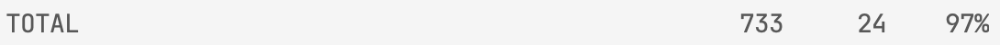

## Тестовое задание
___
Сервер, предоставляющий REST API сервисы, реализующее функционал
для работы с данными моделей:
- Человек,
- Студент,
- Преподаватель,
- Предмет обучения,
- Группа обучаемых,
- Занятие.


Покрытие сервисов тестами.
___

## Реализация
___

### Стек:
- Python 3.10
- Django 2.2
- Django Rest Framework 3.13
- Docker

### Запуск проекта:

В корневой директории: `docker-compose up --build -d`.

Сервер доступен по адресу: `localhost:8000`.

### Запуск тестов:

1) В корневой директории: `docker-compose up db -d`
2) `python manage.py test .`

### Функционал и архитектура:

- Проект состоит из двух приложений `people` и `lessons`, объединяющих в себе модели абстракций, связанных с людьми
и учебными предметами соответственно.


- Для хранения данных к проекту подключена `PostgreSQL` в виде отдельного докер-контейнера.


- **CRUD**-операции для каждой сущности доступны по следующим адресам:


  - **Студенты**:
    - `api/student` — список всех студентов, создание
    - `api/student/<pk>` — получение записи студента, изменение, удаление
    - При создании и изменении данные о студенте принимаются в следующем виде:
    ```
    {
        "full_name": "Гермиона Грейнджер"
    }

  - **Преподаватели**:
    - `api/teacher` — список всех преподавателей, создание
    - `api/teacher/<pk>` — получение записи преподавателя, изменение, удаление
    - При создании и изменении данные о преподавателе принимаются в следующем виде:

    ```
    {
        "full_name": "Северус Снейп",
        "degree": "Волшебник"
    }

  - **Группы обучаемых**:
    - `api/group` — список всех групп с идентификаторами студентов, создание
    - `api/teacher/<pk>` — получение записи группы с подробным списком обучающихся в ней студентов, изменение, удаление
    - При создании и изменении состава группы с помощью метода `get_or_create` для пользователя
    реализовано динамическое создание нового студента, поэтому данные о группе должны отправляться в следующем виде:

      ```
      {
          "title": "Гриффиндор",
          "students":
              [
                  {
                      "full_name": "Гарри Поттер"
                  },
                  {
                      "full_name": "Рон Уизли"
                  }
              ]
      }

  - **Предмет обучения**:
    - `api/subject` — список всех предметов, создание
    - `api/subject/<pk>` — получение записи предмета с развернутым списком проводимых по нему занятий, изменение, удаление
    - При создании и изменении данные о предмете обучения принимаются в следующем виде:
    ```
    {
        "title": "Травология"
    }

  - **Занятие**:

    - `api/lesson`— список всех занятий, создание
    - На странице списка всех занятий с помощью `django-filters` реализована фильтрация по следующим критериям:
      - Группа обучаемых;
      - Предмет;
      - Преподаватель;
      - Статус занятия.

    - `api/lesson/<pk>` — получение записи занятия, изменение, удаление
    - При создании и изменении занятия предусмотрены следующие ограничения, не позволяющие пользователю:
        - поставить занятию статус «Завершено» раньше указанной в нем даты;
      - создать список отсутствующих студентов, если занятие еще не завершено;
      - добавить в список отсутствующих студентов завершенного занятия тех, кто не обучается в группе,
      в которой проводится данное занятие (в список будут добавлены только студенты, обучающиеся в указанной группе);
      - добавить в список отсутствующих студентов без указания группы обучаемых.
    - Так как при создании и изменении занятия не предусмотрено динамическое создание новых связанных сущностей,
    для удобства, данные о занятии принимаются в следующем виде — с указанием индентификаторов записей связанных моделей:
    ```
    {
        "date": "01/04/2023 10:00:00",
        "status": true,
        "study_subject": 1,
        "teacher": 1,
        "student_group": 1,
        "missing_students": [1, 2]
    }

  - Представления апи реализованы с помощью `ModelViewSet` из `Django Rest Framework`.
  - Проект покрыт тестами на `django-test`.
  - По данным `coverage` (команда `coverage report`) покрытие составляет 97%:
 &nbsp; <p></p>
